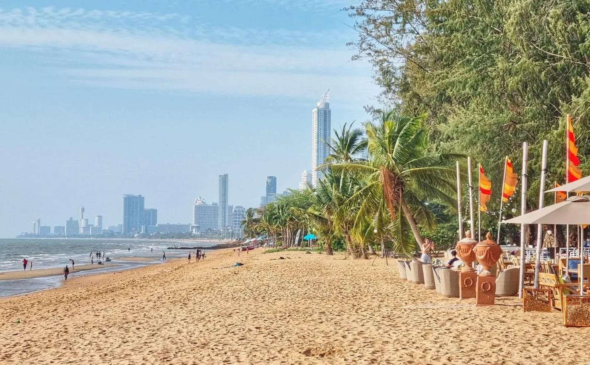

# MiniTravelBuddy 🌍




MiniTravelBuddy is an AI-powered travel recommendation tool built with **LangChain** and **Chroma DB**. It processes natural language inputs (e.g., "budget beach trip") and recommends destinations from a curated dataset using vector-based search. This compact project, training my skills in modern AI tools for software engineering and AI/ML development field.


Please note that this is a small, personal project practicing my technical abilities in the LLm frameworks. Contributions and feedback are welcome! 🚀
- Expand destination dataset 🌴
- Add web interface 💻
- Integrate travel APIs ✈️

---

## ✨ Features 🌟

- **Natural Language Input** 🎙️: Processes travel preferences using LangChain and a local LLM (Ollama).
- **Vector Search** 🔍: Matches queries to destinations with Chroma DB’s semantic embeddings.
- **Simple CLI** ⌨️: Clean, user-friendly command-line interface for instant recommendations.
- **Minimal Design** 🛠️: Small dataset and codebase for quick, impactful demonstration of AI skills.

## 🚀 Quick Start ⚡

### Installation 📥
Clone the repository and set up the project:
```bash
git clone https://github.com/yourusername/MiniTravelBuddy.git
cd MiniTravelBuddy
python -m venv venv
source venv/bin/activate  # On Windows: venv\Scripts\activate
pip install -r requirements.txt
